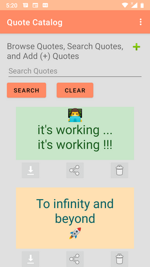
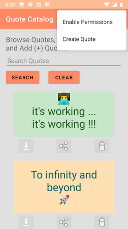
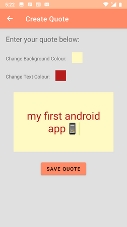
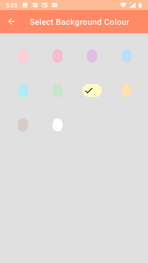
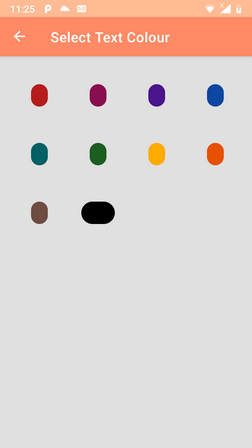

# Quote Catalog Android Kotlin Edition
This app is an Android variation of my MERN full stack application, [Quote Catalog](https://github.com/cek333/Quote_Catalog).

Use the application to create images (of a text message or quote), as well as browse, search, download, share, and delete images.

## Usage
### Browse Images
On the main page you can browse all the images you've created.
 
Enter a search term and press 'Search' to filter images by a keyword in the quotes. Press 'Clear' to remove the search filter and show all quotes.
 

Via the three buttons under each image, you can:
* Download the image to your Pictures folder
* Share the image with another application. Note, before sharing, the image will first be downloaded to your Pictures folder
* Delete the image from the app. (No images are removed from the Pictures folder.)

For the Download and Sharing features, the app will need read/write permisssions to the Pictures folder. To enable permissions from the app, on the Browse page, select 'Enable Permissions' from the settings menu.

To create a new image, press the green plus button (+) in the top-right of the Browse page, or 'Create Quote' from the Settings menu.

### Create Images
On the 'Create Quote' page you can write a new quote.

Enter your quote in the text box. Click on the 'Change ... Colour' boxes to select a new text or background colour. When complete press 'Save Quote'. To navigate back to the Browse page, use the Up button in the ActionBar or your phone's Back button.

# Technical Details
The app was written in Kotlin and built with Android Studio 4.1.2.
The Browse page utilizes a RecyclerView.
There's a ViewModel for the Browse Page and a separate ViewModel for the Create Page.
Data is stored to a Room database.